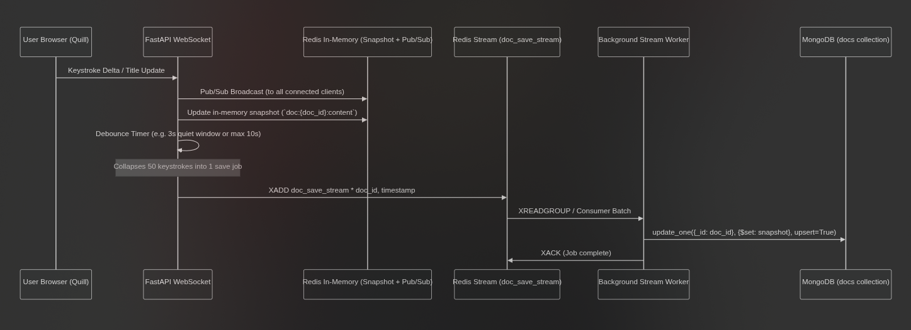

# 📝 Docs Collab — Real-Time Collaborative Document Editor

[](https://fastapi.tiangolo.com)
[](https://www.python.org/)
[](https://www.docker.com/)
[](https://www.postgresql.org/)
[](https://www.mongodb.com/)
[](https://redis.io/)

A scalable, real-time collaborative document editor inspired by Google Docs. Built with **FastAPI**, **Redis Pub/Sub & Streams**, **MongoDB**, **PostgreSQL**, and **Quill.js 2.0**.

---

## 🌟 Features

- **⚡ Real-Time Multi-User Collaboration**: Live keystroke synchronization with Quill Delta operations over WebSockets (< 5ms latency).
- **🛡️ Conflict-Free Offset Architecture**: Unique client session tracking prevents self-broadcast echo loops and paragraph corruption.
- **🚀 Scalable 2-Tier Persistence**:
  - **Hot Path**: Instant in-memory synchronization via Redis Pub/Sub.
  - **Cold Path**: Asynchronous Redis Streams queue + In-Memory Debounce Buffer (3-second quiet window) that collapses high-frequency typing into batched atomic MongoDB upserts (reducing database write load by **~98%**).
- **🔒 Secure JWT Authentication**: Stateless authentication with bcrypt password hashing in **PostgreSQL**, supported by secure `HttpOnly` cookies and standard Bearer tokens.
- **📄 Document Hydration**: Cold/warm document hydration from Redis cache or MongoDB so returning collaborators always see the latest state.
- **🏷️ Real-Time Document Title Synchronization**: Real-time broadcast and persistent synchronization of document titles across all active room participants.
- **🎨 Google Docs-Inspired UI**: Beautiful interface styled with Tailwind CSS, featuring an independent sticky formatting toolbar, document page layout with standard margins, user badges, share link copy toast, and recent rooms history.
- **🐳 1-Command Docker Deployment**: Ready-to-run multi-container setup via Docker Compose.

---

## 🏗️ System Architecture



### 🔄 End-to-End Data Flow

1. **Live Collaboration (< 5ms)**:
   - When a user types in **Quill.js**, Delta operations and title changes are streamed over a **WebSocket** connection (`/ws/{doc_id}`).
   - The FastAPI backend immediately broadcasts the Delta to all active room participants via **Redis Pub/Sub** and updates the hot in-memory snapshot (`doc:{doc_id}:content`).
   - Client-side sender ID filtering ignores echo broadcasts, preventing character duplication and cursor displacement.

2. **Debounce Buffer & Write Consolidation**:
   - Instead of writing to the persistent database on every keystroke, an in-memory **Debounce Timer** (3-second inactivity window) buffers changes.
   - High-frequency typing bursts (e.g. 50+ keystrokes) are collapsed into a single consolidated persistence event.

3. **Asynchronous Redis Streams Queue**:
   - Once the debounce timer expires, a save job is enqueued into **Redis Streams** (`doc_save_stream`) via `XADD`.

4. **Background Persistence Worker**:
   - A dedicated background consumer worker processes the stream queue using `XREADGROUP`.
   - It performs an atomic `update_one` (`$set` snapshot) upsert in **MongoDB** and acknowledges the job with `XACK`.

---

## 📂 Project Structure

```text
Google-Docs/
├── app/
│   ├── auth/                     # Authentication Module
│   │   ├── models.py             # SQLModel User table schema
│   │   ├── routes.py             # Login, Register, Logout, Verify routes & JWT dependency
│   │   ├── schemas.py            # Pydantic validation models (UserCreate, UserLogin, Token)
│   │   └── services.py           # Password hashing (bcrypt) and JWT token generator
│   │
│   ├── core/                     # Application Core & Config
│   │   ├── database.py           # PostgreSQL engine & session lifecycle
│   │   └── settings.py           # Pydantic BaseSettings (Redis, Postgres, Mongo, JWT)
│   │
│   ├── editor/                   # Document Editor Module
│   │   └── routes.py             # Editor HTML pages & /editor/api/metadata endpoint
│   │
│   ├── network/                  # Real-Time WebSocket Manager
│   │   └── manager.py            # ConnectionManager & local socket broadcaster
│   │
│   ├── services/                 # Persistence & Worker Services
│   │   ├── mongo.py              # Motor Async MongoDB client & document upsert operations
│   │   └── stream_worker.py      # Redis Streams consumer worker & debounce manager
│   │
│   └── main.py                   # FastAPI application root, lifespan & WebSocket endpoint
│
├── templates/                    # Jinja2 Frontend Templates (Tailwind CSS)
│   ├── auth/
│   │   └── login.html            # Dual-tab Sign In / Sign Up page
│   ├── editor/
│   │   ├── editor.html           # Document editor page with sticky toolbar & live sync
│   │   └── room.html             # Documents hub with 1-click creation & recent rooms
│   └── home.html                 # Landing page with dynamic authentication state
│
├── docker-compose.yaml           # Docker Compose setup (App, Redis, PostgreSQL, MongoDB)
├── Dockerfile                    # Multi-stage Python 3.12 Dockerfile with uv
├── .dockerignore                 # Excluded files for Docker build
├── pyproject.toml                # Python dependencies and project metadata
├── uv.lock                       # Deterministic lockfile
└── README.md                     # Project documentation
```

---

## 🛠️ Tech Stack

| Component | Technology | Purpose |
|---|---|---|
| **Web Framework** | [FastAPI](https://fastapi.tiangolo.com/) | High-performance async REST & WebSocket server |
| **Relational DB** | [PostgreSQL 17](https://www.postgresql.org/) | User credentials & authentication storage |
| **Document DB** | [MongoDB](https://www.mongodb.com/) | Document content, versioning, and formatting |
| **Cache & Broker** | [Redis 7.4](https://redis.io/) | Real-time Pub/Sub broadcasting and Streams queue |
| **Rich Text Editor** | [Quill.js 2.0](https://quilljs.com/) | WYSIWYG document editor with Delta representation |
| **Auth & Security** | [PyJWT](https://pyjwt.readthedocs.io/) & [Bcrypt](https://pypi.org/project/bcrypt/) | Stateless JWT tokens and salted password hashes |
| **ORM / ODM** | [SQLModel](https://sqlmodel.tiangolo.com/) & [Motor](https://motor.readthedocs.io/) | Database drivers for PostgreSQL & MongoDB |
| **Styling** | [Tailwind CSS](https://tailwindcss.com/) & [Inter Font](https://fonts.google.com/specimen/Inter) | Clean, responsive Google Docs aesthetic |
| **Containerization** | [Docker](https://www.docker.com/) & [Docker Compose](https://docs.docker.com/compose/) | Automated container deployment |

---

## 🚀 Getting Started with Docker (Recommended)

### Prerequisites
- [Docker](https://docs.docker.com/get-docker/) & [Docker Compose](https://docs.docker.com/compose/install/) installed on your machine.

### 1. Clone the Repository
```bash
git clone https://github.com/your-username/Google-Docs.git
cd Google-Docs
```

### 2. Start the Entire Application Stack
Run a single command to build and launch **FastAPI**, **PostgreSQL**, **MongoDB**, and **Redis**:

```bash
docker compose up -d
```

### 3. Open in Browser
- **Application URL**: [http://localhost:8000](http://localhost:8000)
- **Document Hub**: [http://localhost:8000/editor](http://localhost:8000/editor)
- **Sign In / Sign Up**: [http://localhost:8000/auth/login](http://localhost:8000/auth/login)

---

## 💻 Local Development Setup (Without Docker App Container)

If you prefer running FastAPI directly on your host machine while using Docker for the databases:

### 1. Install `uv` Package Manager
```bash
curl -LsSf https://astral.sh/uv/install.sh | sh
```

### 2. Start Background Databases (Redis, PostgreSQL, MongoDB)
```bash
docker compose up -d redis db mongodb
```

### 3. Install Dependencies
```bash
uv sync
```

### 4. Run Development Server
```bash
PYTHONPATH=app uv run uvicorn main:app --reload --port 8000
```

---

## ⚙️ Environment Variables

The application can be configured via environment variables (or `.env` file). Default values are pre-configured:

| Variable | Default Value | Description |
|---|---|---|
| `POSTGRES_HOST` | `localhost` (or `db` in Docker) | PostgreSQL hostname |
| `POSTGRES_PORT` | `5432` | PostgreSQL port |
| `POSTGRES_USER` | `user` | PostgreSQL database user |
| `POSTGRES_PASSWORD` | `password` | PostgreSQL database password |
| `POSTGRES_DB` | `editor` | PostgreSQL database name |
| `REDIS_HOST` | `localhost` (or `redis` in Docker) | Redis server hostname |
| `REDIS_PORT` | `6379` | Redis server port |
| `MONGO_HOST` | `localhost` (or `mongodb` in Docker) | MongoDB server hostname |
| `MONGO_PORT` | `27017` | MongoDB server port |
| `MONGO_USER` | `admin` | MongoDB root username |
| `MONGO_PASSWORD` | `SuperSecurePassword123` | MongoDB root password |
| `MONGO_DB` | `editor_db` | MongoDB database name |
| `SECRET_KEY` | *(256-bit key)* | Secret key for JWT signing |
| `ALGORITHM` | `HS256` | JWT signing algorithm |

---

## 📡 API & WebSocket Reference

### Authentication Endpoints
- `POST /auth/register` — Registers a new user and sets `access_token` cookie.
- `POST /auth/login` — Authenticates user and sets `access_token` cookie.
- `GET /auth/logout` — Clears authentication cookie and redirects to login.
- `GET /auth/verify` — Validates JWT token and returns current user details.
- `GET /auth/login` — Renders the Sign In / Sign Up UI.

### Editor Endpoints
- `GET /` — Renders the landing page with contextual auth status.
- `GET /editor` — Renders the Documents Hub dashboard (requires authentication).
- `GET /editor/{doc_id}` — Renders the collaborative editor for the given document ID.
- `GET /editor/api/metadata?ids=id1,id2` — Returns real-time title metadata for room list cards.

### Real-Time WebSocket Channel
- `ws://localhost:8000/ws/{doc_id}` — Bi-directional real-time collaboration channel.
  - **Payload Types**:
    - `init` &rarr; Server sends initial document snapshot (title and Delta content) on connection.
    - `delta` &rarr; Client broadcasts incremental keystroke Delta and full content snapshot.
    - `title` &rarr; Real-time document title updates across collaborators.

---

## 🛠️ Useful Docker Commands

```bash
# View live logs of all services
docker compose logs -f

# View live logs of the FastAPI application only
docker compose logs -f app

# Stop all containers
docker compose down

# Rebuild the app image after code updates
docker compose build app

# Stop and wipe all persistent database volumes
docker compose down -v
```

---

## 📄 License

Distributed under the MIT License. See `LICENSE` for more information.
